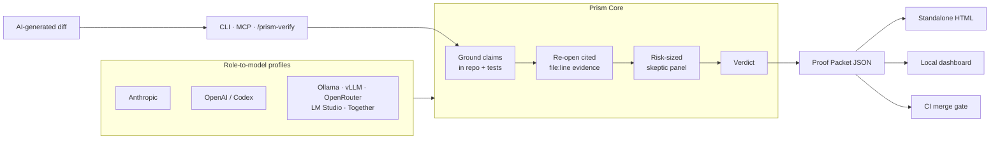
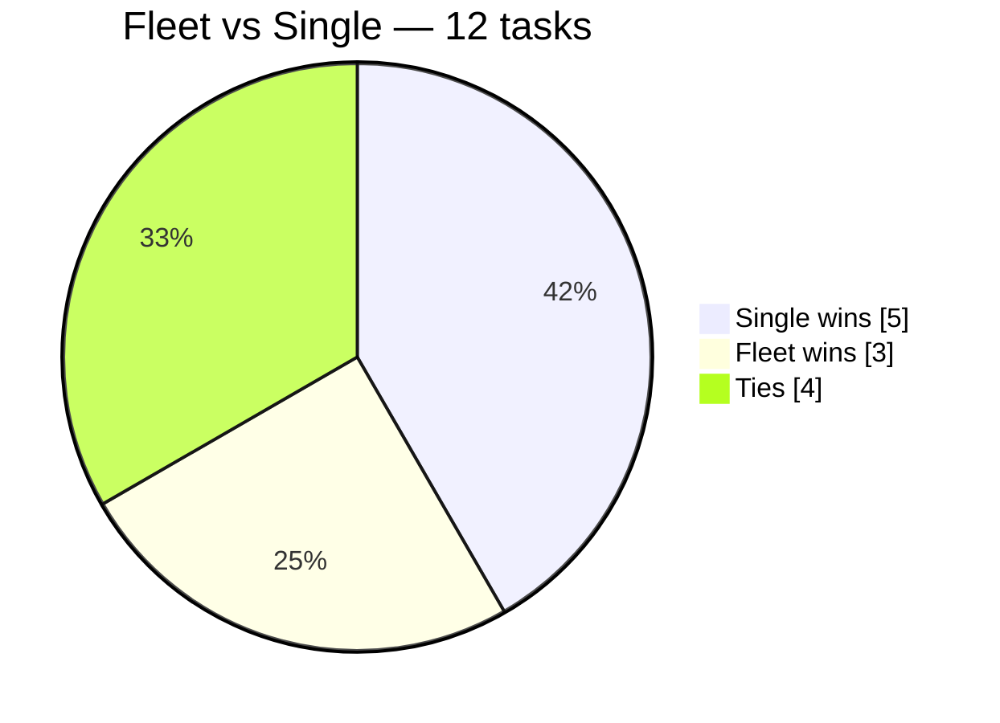

# Prism 🔱 — the proof layer for AI-generated software

> *AI writes the change. Prism builds the case for whether that change should ship.*

Prism is a model-agnostic verification engine and orchestration toolkit for AI-assisted
software development. It grounds claims in the real repository, can run adversarial reviewers
across model lineages, records test evidence, and emits a schema-valid **Proof Packet** with
an `accept`, `human-review`, or `block` verdict.

Use it through the Core CLI, an MCP server, a local proof dashboard, or the native
[Claude Code](https://claude.com/claude-code) slash-command lifecycle. Provider adapters
support Anthropic, OpenAI/Codex, Ollama, vLLM, OpenRouter, LM Studio, Together, and custom
OpenAI-compatible endpoints.

> **One sentence:** Prism turns “the agent says it works” into inspectable evidence another
> model, a reviewer, or CI can challenge.

## What ships today

| Surface | What it does |
|---|---|
| **Prism Core** | TypeScript verification engine: model grounding → structural citation checks → risk-sized skeptic panel → deterministic verdict |
| **Proof Packet** | Provider-neutral JSON contract covering evidence, tests, assumptions, risks, verdict, and telemetry |
| **CLI** | Verifies staged, worktree, branch, commit-range, or GitHub PR diffs; returns CI-friendly exit codes |
| **MCP server** | Exposes `prism_verify` to Claude Code, Codex, Cursor, Zed, and other MCP clients |
| **Dashboard + renderer** | Builds a local run history and model-comparison view; renders standalone HTML proof artifacts |
| **Native Claude commands** | Thirteen commands for understanding, planning, building, implementing, attacking, verifying, learning, and shipping |
| **Provider profiles** | `mock`, all-local Ollama, Claude-only, cross-model balanced, and custom role-to-model maps |

---

## Architecture at a glance


> ✏️ **Editable hand-drawn version:** [`architecture.excalidraw`](architecture.excalidraw) —
> open it at [excalidraw.com](https://excalidraw.com) (File → Open) to edit or export a PNG/SVG.



**How to read it:** the diff and repository are the case file. Prism assigns grounding and
skeptic roles to configured models, checks whether cited evidence really exists, asks skeptics
to break load-bearing claims when the change warrants a panel, and derives a deterministic
verdict. The JSON schema is the spine: the
CLI, MCP server, renderer, dashboard, and CI all consume the same Proof Packet.

---

## Does the fleet actually beat one careful pass? We measured it.

Prism's own proof harness was run on a 12-task design battery. The honest result:



**A single careful Opus pass beat the 8-lens fleet 5–3 (4 ties) at ~4.6× lower token cost**
(Wilson 95% CI [0.19, 0.68]). On open-ended design the fleet does *not* earn its cost — its one
real edge is **defect-finding** (all 3 fleet wins were a lens catching a concrete cited bug,
including real bugs in Prism's own files). So: **shrink the default; reserve the fleet for
review/defect-finding** — though the result is confounded (hand-synthesis quality, defect-free
domain, single judge), making it *shrink-leaning, not proven*.

This is the harness doing its job — a proof tool willing to recommend its own reduction. Full
methodology, per-task numbers, and caveats: **[`EVAL-REPORT.md`](EVAL-REPORT.md)**.

---

## Why this exists

A single LLM pass has predictable failure modes:

- it anchors on the **obvious** answer and never stress-tests it,
- it **averages** conflicting considerations instead of resolving them,
- it states plausible-but-wrong claims **confidently**,
- it gives you a conclusion but not the **reasoning** you'd need to trust or learn from it.

Prism attacks each of those directly:

| Failure mode | The fix in Prism |
|---|---|
| Anchoring on the obvious | An **adversary lens** is always in the panel, arguing the strongest case *against* |
| Averaging conflicts | A **judge** step that resolves contradictions and picks the better-supported side — never a merge |
| Confident-but-wrong claims | **Adversarial verification** — 3 skeptics try to refute each load-bearing claim; majority rules |
| Answer without reasoning | **Expert format** output: recommendation, *steelman of the rejected option*, assumptions, and what would change the answer |

---

## The thirteen commands

| Command | Use it to… | What runs under the hood |
|---|---|---|
| **`/prism-understand`** | Understand how existing code or a concept works | Parallel explorers (one per subsystem) → synthesized into one model + a `file:line` map. Builds/updates project memory. Read-only, fast. |
| **`/prism-plan`** | Design a feature, change, or architecture decision | Reads project memory → adaptive lens panel → judge → grounding + adversarial verify → refinement loop → saved decision doc |
| **`/prism-build`** | Stand up a new project from scratch | Frame the goal → architect the stack (verified) → decompose into a phased, dependency-checked roadmap that ships v1 first |
| **`/prism-implement`** | Turn a planned milestone into working code | Write → run tests → diagnose → fix, looping until it actually passes. Regression-safe, never fakes green, escalates instead of thrashing |
| **`/prism-feedback`** | Stress-test & try to break a feature | Adversarial QA — maps the attack surface, runs real probes (boundary/malicious/concurrency/failure/auth), reproduces every finding, reports severity-ranked feedback + what held up |
| **`/prism-retro`** | Learn from a shipped plan | Compares what the plan PREDICTED vs what actually shipped → writes the lessons back into project memory |
| **`/prism-prune`** | Keep memory trustworthy | Re-verifies every cited invariant against the live code; prunes/corrects stale entries so memory doesn't rot as it grows |
| **`/prism-eval`** | Prove the fleet beats one pass | Measures divergence, grounding precision/recall, fleet-vs-single win-rate, injected-flaw detection, and the minimal config that still wins — willing to recommend shrinking the default |
| **`/prism-verify`** | Decide whether an AI-generated diff is safe to merge | Independently grounds claims, runs risk-sized skeptics and tests, then emits a Proof Packet with an accept / human-review / block verdict |
| **`/prism-write`** | Write human docs for what you built | README · change summary · retroactive code comments · or a clean self-contained HTML article with an architecture diagram. Grounded in the real files, human voice, no slop, no em-dashes. JetBrains style by default; asks for the article only |
| **`/prism-ship`** | Idea → working dapp, one command | Drives the whole lifecycle autonomously — frame (asks its own gating Qs) → architect → decompose → implement each milestone in self-correcting loops → attack with the full feedback fleet → learn. Pauses only at scope, the approved architecture, and irreversible one-way doors |
| **`/prism`** | Not sure which — let it decide | Auto-classifies the task into understand / plan / build and runs the right one |

#### Command index (auto-generated)
<!-- prism:commands -->
- `/prism-build`: Build a project/system from scratch — frame the goal, architect the stack (verified), then decompose into a phased, dependency-checked roadmap that ships v1 first. Saved as a build plan.
- `/prism-eval`: Prism's own proof harness — measure whether the fleet actually beats a single careful pass. Reports divergence, grounding precision/recall, fleet-vs-single win-rate, injected-flaw detection, and the minimal config that still wins. Built to be able to say "shrink the default."
- `/prism-feedback`: Adversarially stress-test a target — first confirm WHAT it is and whether you own it, then either actively break it (your code) or passively assess it (third-party), reproduce every finding, and report honest severity-ranked feedback. Never attacks infrastructure you don't own.
- `/prism-implement`: Turn ONE planned milestone into working, tested code — write → run → diagnose → fix until it actually passes, then update project memory. The execution loop that closes idea → shipped code. Self-correcting, regression-safe, never fakes a pass.
- `/prism-plan`: Plan a feature / change / architecture decision — adaptive lens panel, adversarial verification, refinement loop to convergence, saved as a decision doc. ("quick" forces one cheap pass.)
- `/prism-prune`: Memory hygiene — review .prism/project-model.md, verify each invariant still holds against the live code, and prune/correct stale or wrong entries so memory stays trustworthy as it grows.
- `/prism-retro`: Close the loop — compare what a prism plan PREDICTED against what actually shipped, then write the lessons back into project memory so future runs are smarter. This is what makes prism learn.
- `/prism-ship`: One command, idea → working dapp. Autonomously chains the full Prism lifecycle — frame → architect → decompose → implement each milestone in self-correcting loops → adversarially test → learn — generating its own follow-up work and looping until done. Pauses only at scope, the approved architecture, and irreversible one-way doors. Cost-tuned per the eval (lean fleet to design, full fleet to attack).
- `/prism-understand`: Understand/map existing code or a concept — parallel explorers over each subsystem, synthesized into one coherent model with a file map. Read-only, fast.
- `/prism-update`: Update your installed Prism to the latest source — pull the clone, re-sync commands + hooks into ~/.claude, prove it landed with the drift check, and tell you what is new. Safe and reversible; never touches your project code.
- `/prism-verify` _(skill — also auto-invoked)_: The proof layer for AI-generated code. Use RIGHT AFTER a coding agent (or you) finishes a diff and BEFORE it is merged or deployed — take the change and independently verify it is correct, grounded in the real repo, current with its libraries, and safe to merge. Emits a structured Proof Packet with an accept / human-review / block verdict. Invoke when the user says "verify this", "is this safe to merge", "review this diff/PR", "prove it works", or when a change touches money, auth, custody, migrations, a public API, or deletes data. Does NOT reuse the generating agent's reasoning.
- `/prism-write`: Write human docs for what you built. Grounded README, change summary, retroactive code comments, or a clean self-contained HTML article with an architecture diagram. Human voice, no AI slop, no em-dashes. JetBrains style by default; asks for the article only.
- `/prism`: Multi-agent orchestration playbook — auto-routes a task into understand/plan/build, fans parallel lenses, adversarially verifies, loops to convergence, and persists. ("quick" forces a single cheap pass.)

_13 commands and skills. Auto-generated by `scripts/sync-docs.sh`; do not edit by hand._
<!-- /prism:commands -->

### Is the deliberation real, or theatre? (measured, not asserted)
Prism's bet — that fanning one model into lenses + judging + adversarial verify beats a single
careful pass — is now **measurable**, not just claimed:
- **Differential context** routes each domain lens to the code its concern owns, so lenses see
  *different* code, not just read different prompts.
- A **divergence score** (Jaccard overlap of the `file:line` sets each lens examined + conclusion
  disagreement) prints on every run and **flags when diversity is cosmetic**.
- Native Claude commands can run a **2× Opus + 1× Sonnet cross-tier** split. Prism Core adds
  genuine **cross-model** profiles spanning Claude, GPT/Codex, and open models. Every packet records
  the actual decorrelation axis as `single-model`, `cross-tier`, or `cross-model`; it never inflates
  one into another.
- `/prism-eval` + `eval/fixtures/` turn all of this into real numbers — and the harness is
  explicitly allowed to conclude **"shrink the default — the smaller config wins."**

All commands share the same primitives (below). The named commands are leaner, focused
entry points; `/prism` is the catch-all router.

## What makes it different: it compounds

Most prompts and workflows are **stateless** (start from zero every time), **ungrounded**
(reason about your code from a shallow read), and **open-loop** (never learn if their advice
was right). This skill closes all three gaps — and that's the real differentiator:

- **Project memory** — `/prism-understand` builds `.prism/project-model.md`: a durable,
  evidence-cited model of *your* codebase (architecture, **invariants**, danger zones,
  decisions, lessons). Every later run reads it first, so the skill gets smarter about your
  project over time instead of re-deriving it.
- **User memory** — a second, *global* layer (`~/.prism/user.md`) about the **human**, not the
  code. Every command reads it first, greets you by name, and adapts to your tone, expertise, and
  **standing defaults** (testnet-first, branch-before-code, commit-only-when-asked) without being
  re-told — capturing your durable preferences and corrections as they surface. Kept deliberately
  separate from project memory; a fresh install bootstraps from `git config user.name`, so it greets
  whoever clones it (template: [`user.example.md`](user.example.md)).
- **Grounding verifier** — every claim about your code must cite `file:line`, and a verifier
  agent *re-opens those lines* to confirm. Hallucinated "your code does X" claims get struck.
- **Outcome loop** — after you ship, `/prism-retro` compares predicted vs actual and banks
  the lesson back into memory. The next plan starts from what the last one got wrong.

Together: **stateful (about the project *and* you) + grounded + self-improving** — a different
category from one-shot tools.

## The closed loop: idea → working code → lessons

The commands form a full lifecycle, each stage banking what it learned into project memory:

```
understand ──► plan / build ──► implement ──► retro ──┐
     ▲                                                │
     └──────────── project memory gets smarter ◄──────┘
```

`/prism-implement` is the execution loop that most "AI planner" tools lack: it writes one
slice, **runs the actual tests**, reads the real errors, and self-corrects until green —
with hard guards against the classic agent failure modes:

- **Never fakes a pass** — forbidden to delete/skip/weaken a test to go green.
- **Regression-safe** — runs the *full* suite every iteration, not just the new test.
- **No infinite loops** — hard cap; on a repeated error it changes strategy, then escalates
  with a clean handoff instead of thrashing.
- **Independent verification** — a skeptic agent checks the feature *actually* meets the
  acceptance criteria (not just that a trivial test passed).
- **Respects one-way doors** — branches before touching main; stops and asks before deploy,
  DB migration, secrets, or anything irreversible.

---

## Enforcement: from prompts to hard rules

Most "agent guards" are just text the model is *asked* to follow — so a long context or an
off day and they get skipped. Prism ships the critical ones as **real Claude Code hooks** that
the model cannot bypass:

- **`hooks/prism-guard.sh`** (a `PreToolUse` Bash hook) runs *before every shell command* and
  **blocks one-way doors** — force-push, `npm publish`, `vercel --prod`, `prisma migrate
  deploy`, `cast send`, `rm -rf`, `drop table`, etc. The model literally can't run them until
  the user explicitly approves (by appending a `# PRISM_OK` token). This turns "I promise to
  stop at irreversible actions" into the system stopping them.
- **`hooks/prism-gate.sh`** is the integrity check `/prism-implement` runs on its diff before
  declaring done — it catches the classic cheat of faking a green by skipping/deleting tests,
  plus hardcoded secrets and leftover debug.

Wire them up (copy `settings.example.json`'s `hooks` block into your `settings.json`):

```bash
mkdir -p ~/.claude/hooks
cp hooks/*.sh ~/.claude/hooks/ && chmod +x ~/.claude/hooks/*.sh
# then merge settings.example.json's "hooks" block into ~/.claude/settings.json
# (global) or <repo>/.claude/settings.json (one project)
```

---

## How it works — the building blocks

Every command is assembled from the same five moves:

1. **Fan-out** — launch N agents *in parallel*, each with a distinct lens or scope. The
   diversity rule: never give two agents a lens that would return the same brief. More
   agents only help when they see *different* things.
2. **Judge** — read every brief and produce structured analysis, **not** a blend:
   consensus, direct contradictions (+ which side is better supported), unique insights
   only one agent caught, and blind spots none addressed.
3. **Verify (adversarial)** — pull the conclusion's load-bearing claims; for each, spawn
   skeptics whose *only* job is to refute it. A claim a majority of skeptics can break is
   struck from the answer.
4. **Loop** — re-attack the draft in critique mode, fold in only the fixes that survive,
   and repeat until a round changes nothing material (convergence) — capped at 3 rounds.
5. **Persist** — for plan/build runs, save the converged result as a numbered markdown
   file in your project's `docs/` folder (never overwriting).

### The lens roster

- **Core (always):** first-principles · adversary · practitioner
- **Domain (added by relevance):** security/threat · regulatory/compliance ·
  data-integrity · cost/economics · UX/flow · simplicity/YAGNI · scale/ops · testability
- **Mandatory rule:** if the task moves money, holds funds, or touches auth/custody, both
  the **security** and **regulatory** lenses are forced into the panel.

### Fleet sizing (defaults)

- **Fan-out:** 6 agents (3 core + 3 domain); high-stakes tasks → 8
- **Verify:** top 4 load-bearing claims × 3 skeptics each
- **Loop:** hard cap 3 rounds; only *new* claims are re-verified each round
- **`quick` / `fast`:** 3 core lenses, no verify panel — the cheap path

### Expert-format output (plan & build)

Every plan/build answer is structured to teach the *reasoning*, not just hand over a verdict:

1. **Recommendation** — leads with the answer
2. **Why** — the load-bearing reasons
3. **Steelman of the rejected option** — its *strongest* case first, then why it still lost
4. **Assumptions & falsifiers** — what the answer rests on, and what would *change* it
5. **Open questions for the human** — the calls only you can make
6. **Grounded** — code claims cite `file:line`; external facts cite a source

---

## Install

### Core CLI and dashboard

Prism Core requires Node.js 20 or newer:

```bash
git clone https://github.com/Adityaakr/prism-claude-code.git
cd prism-claude-code
npm --prefix core install
npm --prefix core run build

# Deterministic plumbing check. This does not call a real model.
node core/dist/cli.js verify --source worktree --profile mock

# Build .prism/dashboard.html from saved Proof Packets.
node core/dist/cli.js dashboard
```

For real verification, choose a built-in profile or copy
[`prism.config.example.json`](prism.config.example.json) to `prism.config.json` and map each
role to a model:

| Profile | Models | Requirements |
|---|---|---|
| `mock` | Deterministic fixtures | No keys; smoke tests only, not evidence that code is correct |
| `local` | Qwen, DeepSeek, and Llama through Ollama | A running Ollama server with the configured models |
| `claude` | Anthropic models | `ANTHROPIC_API_KEY` |
| `balanced` | Claude + GPT/Codex + Ollama | `ANTHROPIC_API_KEY`, `OPENAI_API_KEY`, and Ollama |

```bash
# Verify the current branch against the repository's default branch.
node core/dist/cli.js verify \
  --source branch \
  --profile balanced \
  --task "Add proof-layer support" \
  --test-cmd "npm --prefix core test"

# Other diff sources:
# --source staged
# --source worktree
# --source commit-range --ref HEAD~3..HEAD
# --source branch --base main
# --pr 42                    # requires gh
```

The CLI writes JSON and HTML to `.prism/runs/`. Its exit code is `0` for accept, `1` for
block, `3` for human review, and `2` for a usage or runtime error, so the same command can
act as a CI merge gate.

### MCP server

Install the optional MCP SDK and start the stdio server:

```bash
npm --prefix core install --no-save @modelcontextprotocol/sdk
npm --prefix core run mcp
```

The server exposes `prism_verify`, returning both the verdict and the full Proof Packet to
any MCP-compatible host.

### Claude Code plugin (one command)

Prism ships as a Claude Code plugin. Add the marketplace and install — no cloning, no copying,
no editing `settings.json`:

```
/plugin marketplace add Adityaakr/prism-claude-code
/plugin install prism@prism
```

That single install drops in everything at once:

- **`/prism-verify` — a model-invoked skill.** The proof layer. Claude reaches for it on its own
  right after it finishes a diff (or run it yourself with `/prism-verify`), so verification happens
  before merge without you remembering to ask.
- **The full command lifecycle** — `/prism`, `/prism-plan`, `/prism-implement`, `/prism-ship`,
  `/prism-feedback`, `/prism-retro`, and the rest, in the `/` picker.
- **The one-way-door guard hook** — blocks irreversible Bash commands (deploy, publish, force-push,
  push-to-main, db migrate, mainnet tx, destructive delete) unless the command carries an explicit
  `# PRISM_OK` token. No `settings.json` merge required.

Restart Claude Code (or retype `/`) and everything appears. Because the plugin is installed from the
marketplace rather than copied in, `/plugin marketplace update prism` pulls the latest — no drift.

The plugin is the Claude Code convenience layer. The **Core CLI** and **MCP server** above are the
model-agnostic path (Codex, Cursor, Zed, open models) and are installed separately.

### Manual command install (fallback)

If you'd rather not use the plugin system, Claude Code still reads slash commands from
`.claude/commands/`. Copy them at whichever scope you want:

```bash
# Run from the cloned prism-claude-code directory.

# Global — available in every project
mkdir -p ~/.claude/commands
cp commands/*.md ~/.claude/commands/

# OR per-project — available only inside one repo (and shareable via git)
mkdir -p /path/to/your-project/.claude/commands
cp commands/*.md /path/to/your-project/.claude/commands/
```

Restart Claude Code (or retype `/`) and the commands appear in the picker. Copied commands drift
from source as Prism ships features; re-sync with `bash scripts/prism-update.sh` (pull + re-copy +
drift check), or just use the plugin above.

Or, from inside Claude Code, run `/prism-update`: it finds your clone, pulls, re-syncs, verifies,
and tells you what changed (read from [`CHANGELOG.md`](CHANGELOG.md)). To check for drift without
applying anything: `bash scripts/prism-version.sh --check`. Restart the session afterward so the
updated commands load.

---

## Usage

```bash
# Independently verify the current worktree and save a Proof Packet
node core/dist/cli.js verify --source worktree --profile local

# Verify a GitHub PR with a genuine cross-model panel
node core/dist/cli.js verify --pr 42 --profile balanced --task "Review PR 42"

# Rebuild the local proof and model-comparison dashboard
node core/dist/cli.js dashboard

# Understand an existing system (read-only, fast)
/prism-understand explain how invoices get paid in this app end to end

# Plan a feature or make an architecture call (auto-loops, verifies, saves a doc)
/prism-plan how should a user pay from their existing in-app balance instead of reconnecting a wallet?

# Build something new from scratch (frames -> architects -> phased roadmap)
/prism-build a stablecoin payroll dApp on Arbitrum

# Verify a generated change from inside Claude Code
/prism-verify verify the staged payment changes before merge

# Let it route automatically
/prism <anything>

# Force a fast, cheap pass on any planning question
/prism-plan quick should we use embedded wallets or a custodial ledger?
```

Each run **states its plan before spending agents** — e.g.
`Mode: looped (spec-shaped) | Fleet: 8 agents` — so you always know what it's about to do.

---

## Cost & honesty notes

- Real Core profiles call the models assigned to every role. The `mock` profile proves the
  pipeline is wired correctly; it does **not** prove a diff is safe.
- Native commands can spawn **many parallel agents**. A deep `/prism-plan` or `/prism-build`
  run can use dozens of agent calls across its loop rounds — that's the point, but it's
  real token cost. Use `quick` for lightweight questions.
- More agents are only better when they're **diverse**. The commands enforce this with the
  diversity rule and an adaptive lens panel — they won't clone the same perspective N times.
- The native command layer is still **prompt-driven**, not magic. If you see it skip a step, add
  `follow every step` to your message, or drop to `quick` so it doesn't over-orchestrate a
  simple ask.

---

## License

MIT — use it, fork it, adapt the lenses to your domain.
