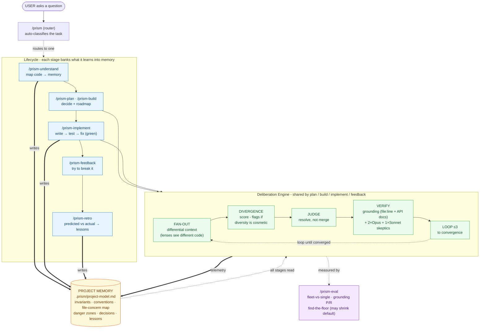
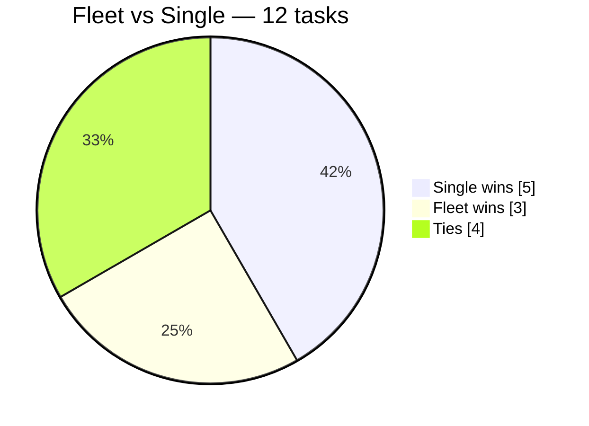

# Prism 🔱 — an orchestration playbook for Claude Code

> *One question goes in; a prism splits it into a full spectrum of expert perspectives,
> then recombines them into one verified answer.*

A set of [Claude Code](https://claude.com/claude-code) slash commands that turn a single
hard question into a **coordinated team of AI agents** — fanning out across diverse
perspectives, judging their disagreements, adversarially verifying the conclusions, and
looping until the answer converges.

Instead of asking one model once and trusting the first answer, you get a deliberation:
many agents reason in parallel from different angles, skeptics try to *refute* the key
claims, and only what survives makes it into the final output.

> **One sentence:** it makes Claude think like a team of experts arguing toward the
> right answer, instead of a single voice guessing at it.

---

## Architecture at a glance


> ✏️ **Editable hand-drawn version:** [`architecture.excalidraw`](architecture.excalidraw) —
> open it at [excalidraw.com](https://excalidraw.com) (File → Open) to edit or export a PNG/SVG.



**How to read it:** one router sends your task to the right stage of a **lifecycle**
(understand → design → implement → retro). The three heavy stages all run the same
**Deliberation Engine** — fan out diverse agents, judge their disagreements, verify the
claims (grounding + skeptics), loop to convergence. Everything reads and writes **Project
Memory**, so each run makes the next one smarter. That read/write cycle is the part one-shot
tools don't have.

---

## Does the fleet actually beat one careful pass? We measured it.

Prism's own proof harness was run on a 12-task design battery. The honest result:



**A single careful Opus pass beat the 8-lens fleet 5–3 (4 ties) at ~4.6× lower token cost**
(Wilson 95% CI [0.19, 0.68]). On open-ended design the fleet does *not* earn its cost — its one
real edge is **defect-finding** (all 3 fleet wins were a lens catching a concrete cited bug,
including real bugs in Prism's own files). So: **shrink the default; reserve the fleet for
review/defect-finding** — though the result is confounded (hand-synthesis quality, defect-free
domain, single judge), making it *shrink-leaning, not proven*.

This is the harness doing its job — a proof tool willing to recommend its own reduction. Full
methodology, per-task numbers, and caveats: **[`EVAL-REPORT.md`](EVAL-REPORT.md)**.

---

## Why this exists

A single LLM pass has predictable failure modes:

- it anchors on the **obvious** answer and never stress-tests it,
- it **averages** conflicting considerations instead of resolving them,
- it states plausible-but-wrong claims **confidently**,
- it gives you a conclusion but not the **reasoning** you'd need to trust or learn from it.

This playbook attacks each of those directly:

| Failure mode | The fix in this skill |
|---|---|
| Anchoring on the obvious | An **adversary lens** is always in the panel, arguing the strongest case *against* |
| Averaging conflicts | A **judge** step that resolves contradictions and picks the better-supported side — never a merge |
| Confident-but-wrong claims | **Adversarial verification** — 3 skeptics try to refute each load-bearing claim; majority rules |
| Answer without reasoning | **Expert format** output: recommendation, *steelman of the rejected option*, assumptions, and what would change the answer |

---

## The ten commands

| Command | Use it to… | What runs under the hood |
|---|---|---|
| **`/prism-understand`** | Understand how existing code or a concept works | Parallel explorers (one per subsystem) → synthesized into one model + a `file:line` map. Builds/updates project memory. Read-only, fast. |
| **`/prism-plan`** | Design a feature, change, or architecture decision | Reads project memory → adaptive lens panel → judge → grounding + adversarial verify → refinement loop → saved decision doc |
| **`/prism-build`** | Stand up a new project from scratch | Frame the goal → architect the stack (verified) → decompose into a phased, dependency-checked roadmap that ships v1 first |
| **`/prism-implement`** | Turn a planned milestone into working code | Write → run tests → diagnose → fix, looping until it actually passes. Regression-safe, never fakes green, escalates instead of thrashing |
| **`/prism-feedback`** | Stress-test & try to break a feature | Adversarial QA — maps the attack surface, runs real probes (boundary/malicious/concurrency/failure/auth), reproduces every finding, reports severity-ranked feedback + what held up |
| **`/prism-retro`** | Learn from a shipped plan | Compares what the plan PREDICTED vs what actually shipped → writes the lessons back into project memory |
| **`/prism-prune`** | Keep memory trustworthy | Re-verifies every cited invariant against the live code; prunes/corrects stale entries so memory doesn't rot as it grows |
| **`/prism-eval`** | Prove the fleet beats one pass | Measures divergence, grounding precision/recall, fleet-vs-single win-rate, injected-flaw detection, and the minimal config that still wins — willing to recommend shrinking the default |
| **`/prism-ship`** | Idea → working dapp, one command | Drives the whole lifecycle autonomously — frame (asks its own gating Qs) → architect → decompose → implement each milestone in self-correcting loops → attack with the full feedback fleet → learn. Pauses only at scope, the approved architecture, and irreversible one-way doors |
| **`/prism`** | Not sure which — let it decide | Auto-classifies the task into understand / plan / build and runs the right one |

### Is the deliberation real, or theatre? (measured, not asserted)
Prism's bet — that fanning one model into lenses + judging + adversarial verify beats a single
careful pass — is now **measurable**, not just claimed:
- **Differential context** routes each domain lens to the code its concern owns, so lenses see
  *different* code, not just read different prompts.
- A **divergence score** (Jaccard overlap of the `file:line` sets each lens examined + conclusion
  disagreement) prints on every run and **flags when diversity is cosmetic**.
- The adversarial skeptics run a **2× Opus + 1× Sonnet (cross-tier)** split to decorrelate blind
  spots — labelled honestly as *cross-tier, not cross-model*, with **grounding outranking cross-tier
  survival**. (Sub-agent model selection is by tier only here; the cross-*version* axis isn't
  available and that limit is recorded in telemetry, never hidden.)
- `/prism-eval` + `eval/fixtures/` turn all of this into real numbers — and the harness is
  explicitly allowed to conclude **"shrink the default — the smaller config wins."**

All commands share the same primitives (below). The named commands are leaner, focused
entry points; `/prism` is the catch-all router.

## What makes it different: it compounds

Most prompts and workflows are **stateless** (start from zero every time), **ungrounded**
(reason about your code from a shallow read), and **open-loop** (never learn if their advice
was right). This skill closes all three gaps — and that's the real differentiator:

- **Project memory** — `/prism-understand` builds `.prism/project-model.md`: a durable,
  evidence-cited model of *your* codebase (architecture, **invariants**, danger zones,
  decisions, lessons). Every later run reads it first, so the skill gets smarter about your
  project over time instead of re-deriving it.
- **User memory** — a second, *global* layer (`~/.prism/user.md`) about the **human**, not the
  code. Every command reads it first, greets you by name, and adapts to your tone, expertise, and
  **standing defaults** (testnet-first, branch-before-code, commit-only-when-asked) without being
  re-told — capturing your durable preferences and corrections as they surface. Kept deliberately
  separate from project memory; a fresh install bootstraps from `git config user.name`, so it greets
  whoever clones it (template: [`user.example.md`](user.example.md)).
- **Grounding verifier** — every claim about your code must cite `file:line`, and a verifier
  agent *re-opens those lines* to confirm. Hallucinated "your code does X" claims get struck.
- **Outcome loop** — after you ship, `/prism-retro` compares predicted vs actual and banks
  the lesson back into memory. The next plan starts from what the last one got wrong.

Together: **stateful (about the project *and* you) + grounded + self-improving** — a different
category from one-shot tools.

## The closed loop: idea → working code → lessons

The commands form a full lifecycle, each stage banking what it learned into project memory:

```
understand ──► plan / build ──► implement ──► retro ──┐
     ▲                                                │
     └──────────── project memory gets smarter ◄──────┘
```

`/prism-implement` is the execution loop that most "AI planner" tools lack: it writes one
slice, **runs the actual tests**, reads the real errors, and self-corrects until green —
with hard guards against the classic agent failure modes:

- **Never fakes a pass** — forbidden to delete/skip/weaken a test to go green.
- **Regression-safe** — runs the *full* suite every iteration, not just the new test.
- **No infinite loops** — hard cap; on a repeated error it changes strategy, then escalates
  with a clean handoff instead of thrashing.
- **Independent verification** — a skeptic agent checks the feature *actually* meets the
  acceptance criteria (not just that a trivial test passed).
- **Respects one-way doors** — branches before touching main; stops and asks before deploy,
  DB migration, secrets, or anything irreversible.

---

## Enforcement: from prompts to hard rules

Most "agent guards" are just text the model is *asked* to follow — so a long context or an
off day and they get skipped. Prism ships the critical ones as **real Claude Code hooks** that
the model cannot bypass:

- **`hooks/prism-guard.sh`** (a `PreToolUse` Bash hook) runs *before every shell command* and
  **blocks one-way doors** — force-push, `npm publish`, `vercel --prod`, `prisma migrate
  deploy`, `cast send`, `rm -rf`, `drop table`, etc. The model literally can't run them until
  the user explicitly approves (by appending a `# PRISM_OK` token). This turns "I promise to
  stop at irreversible actions" into the system stopping them.
- **`hooks/prism-gate.sh`** is the integrity check `/prism-implement` runs on its diff before
  declaring done — it catches the classic cheat of faking a green by skipping/deleting tests,
  plus hardcoded secrets and leftover debug.

Wire them up (copy `settings.example.json`'s `hooks` block into your `settings.json`):

```bash
mkdir -p ~/.claude/hooks
cp hooks/*.sh ~/.claude/hooks/ && chmod +x ~/.claude/hooks/*.sh
# then merge settings.example.json's "hooks" block into ~/.claude/settings.json
# (global) or <repo>/.claude/settings.json (one project)
```

---

## How it works — the building blocks

Every command is assembled from the same five moves:

1. **Fan-out** — launch N agents *in parallel*, each with a distinct lens or scope. The
   diversity rule: never give two agents a lens that would return the same brief. More
   agents only help when they see *different* things.
2. **Judge** — read every brief and produce structured analysis, **not** a blend:
   consensus, direct contradictions (+ which side is better supported), unique insights
   only one agent caught, and blind spots none addressed.
3. **Verify (adversarial)** — pull the conclusion's load-bearing claims; for each, spawn
   skeptics whose *only* job is to refute it. A claim a majority of skeptics can break is
   struck from the answer.
4. **Loop** — re-attack the draft in critique mode, fold in only the fixes that survive,
   and repeat until a round changes nothing material (convergence) — capped at 3 rounds.
5. **Persist** — for plan/build runs, save the converged result as a numbered markdown
   file in your project's `docs/` folder (never overwriting).

### The lens roster

- **Core (always):** first-principles · adversary · practitioner
- **Domain (added by relevance):** security/threat · regulatory/compliance ·
  data-integrity · cost/economics · UX/flow · simplicity/YAGNI · scale/ops · testability
- **Mandatory rule:** if the task moves money, holds funds, or touches auth/custody, both
  the **security** and **regulatory** lenses are forced into the panel.

### Fleet sizing (defaults)

- **Fan-out:** 6 agents (3 core + 3 domain); high-stakes tasks → 8
- **Verify:** top 4 load-bearing claims × 3 skeptics each
- **Loop:** hard cap 3 rounds; only *new* claims are re-verified each round
- **`quick` / `fast`:** 3 core lenses, no verify panel — the cheap path

### Expert-format output (plan & build)

Every plan/build answer is structured to teach the *reasoning*, not just hand over a verdict:

1. **Recommendation** — leads with the answer
2. **Why** — the load-bearing reasons
3. **Steelman of the rejected option** — its *strongest* case first, then why it still lost
4. **Assumptions & falsifiers** — what the answer rests on, and what would *change* it
5. **Open questions for the human** — the calls only you can make
6. **Grounded** — code claims cite `file:line`; external facts cite a source

---

## Install

Claude Code reads slash commands from `.claude/commands/`. Copy these in at whichever
scope you want:

```bash
# Clone
git clone https://github.com/Adityaakr/prism-claude-code.git
cd prism-claude-code

# Global — available in every project
mkdir -p ~/.claude/commands
cp commands/*.md ~/.claude/commands/

# OR per-project — available only inside one repo (and shareable via git)
mkdir -p /path/to/your-project/.claude/commands
cp commands/*.md /path/to/your-project/.claude/commands/
```

Restart Claude Code (or retype `/`) and the commands appear in the picker.

---

## Usage

```bash
# Understand an existing system (read-only, fast)
/prism-understand explain how invoices get paid in this app end to end

# Plan a feature or make an architecture call (auto-loops, verifies, saves a doc)
/prism-plan how should a user pay from their existing in-app balance instead of reconnecting a wallet?

# Build something new from scratch (frames -> architects -> phased roadmap)
/prism-build a stablecoin payroll dApp on Arbitrum

# Let it route automatically
/prism <anything>

# Force a fast, cheap pass on any planning question
/prism-plan quick should we use embedded wallets or a custodial ledger?
```

Each run **states its plan before spending agents** — e.g.
`Mode: looped (spec-shaped) | Fleet: 8 agents` — so you always know what it's about to do.

---

## Cost & honesty notes

- These commands spawn **many parallel agents**. A deep `/prism-plan` or `/prism-build`
  run can use dozens of agent calls across its loop rounds — that's the point, but it's
  real token cost. Use `quick` for lightweight questions.
- More agents are only better when they're **diverse**. The commands enforce this with the
  diversity rule and an adaptive lens panel — they won't clone the same perspective N times.
- The skill is a **prompt**, not magic. If you ever see it skip a step, add
  `follow every step` to your message, or drop to `quick` so it doesn't over-orchestrate a
  simple ask.

---

## License

MIT — use it, fork it, adapt the lenses to your domain.
